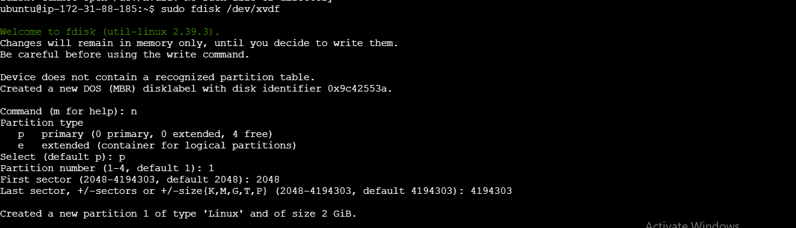
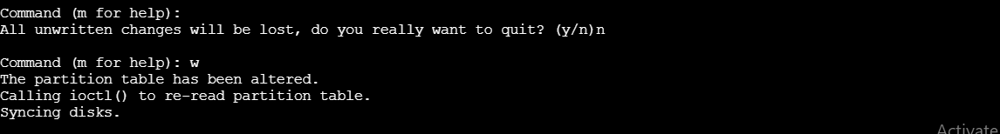
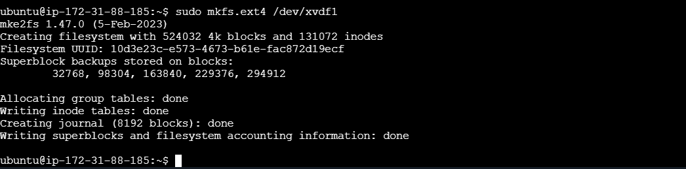
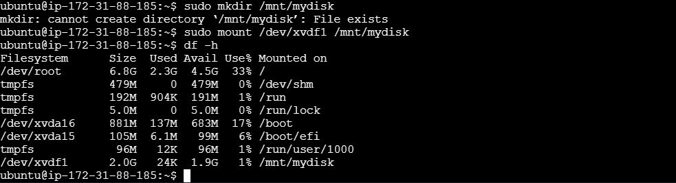
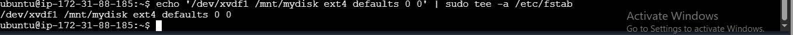

# Disk-maanagement

1. Created a new volume (xvdf)

2. Created a partition (xvdf1)

3. Format the partition

4. mount the partition

Add the partition to /etc/fstab for automatic mounting at boot.
